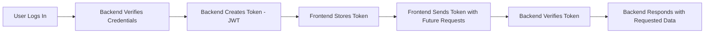
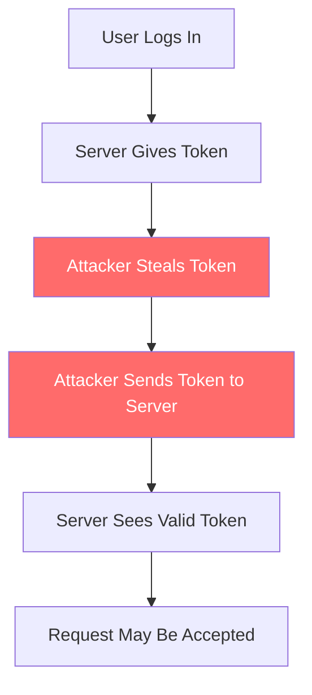
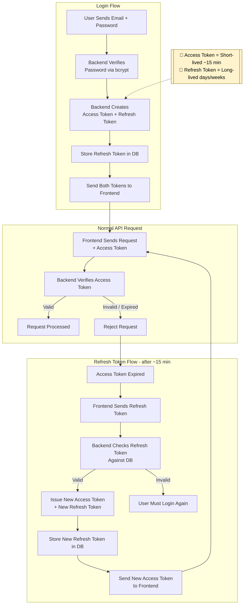
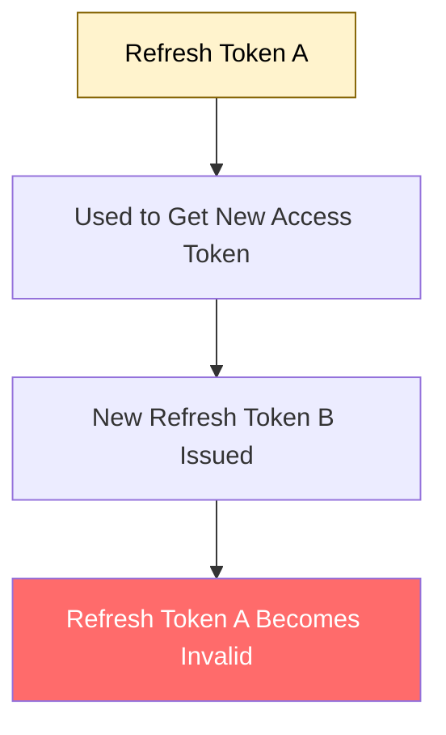

# Access Tokens v/s Refresh Tokens Explained: How Authentication Really Works

You log in once, but how does the server know it's still you on every request? Let's understand what happens behind the scenes.

## Introduction

### What is authentication?

In simple words, authentication is the process of identifying the user who has made a request. But why do we need it?

HTTP is stateless, which means each request is independent and carries no memory of previous requests. So, the server/backend can't automatically remember who sent a previous request.

Don't confuse this with authorization.    
 - **Authentication** → Who are you?
 - **Authorization** → What are you allowed to do?

### What is a Token and Why Do We Need It?

Think of tokens like a temporary ID card that the backend/server gives to the user/client after a successful login. With this ID card, the server can identify and verify the user when they make future requests.

But why can't we simply send our username and password with every request?

Because sending private and sensitive credentials again and again is not a good idea and increases the risk of exposing them. Instead, after login, the server can generate a token and send it back to the client. The client can then use that token with future requests, allowing the server to verify the request without asking for the user's password every time.

## The Risk Behind Using Tokens

### What If the Token Gets Stolen?

Let's assume a basic scenario: user logs in, server gives token, somehow Attacker gets the token, Attacker sends token to server, Server sees valid token, Request may be accepted.

The server generally cares that the presented credential is valid or not, not whether the person holding it is the original user.

So if an attacker gets a usable access token, they may be able to access the resources that token permits.

And that lets us to a point that the longer a token remains valid, the longer an attacker may be able to use it if it gets stolen.

### The Security vs Convenience Problem

All the Long-lived token are generally very Convenient as created once and use them always but it comes with a cost of security through a scenario we talked above.

But why can't we simply make every token extremely short-lived?

Logically Making tokens short-lived reduces the window in which a stolen token can be abused but it could result in user trying to authenticate again and again.

## The Two-Token Approach

Yes! What if we use two token, but how would that solve the security problem lets see that. But before that lets see what 2 types of token we would be using.

### Access Token — For Everyday Requests

The Access Token are essential tool used in token-based authentication which allow the user to access normal API requests.

After a successful login, the backend issues an access token to the client, which is then used as a credential for accessing protected APIs

They are generally very short-lived, often lasting for minutes rather than days. So if stolen the attacker get's access to private resource for a very limited time resulting in reducing the damage window.

### Refresh Token — The Key to Staying Logged In

It is the token the client uses to request a new access token from the backend when the current access token expires, most importantly it is not meant to be sent with every API request and only used when access token expires. It is generally a long-lived token.

This allows the user to stay logged in without entering their password again

### How They Work Together

In our implementation, the backend stores the refresh token (or its hash) and checks it when a refresh request is made.

## What If Both Tokens Are Compromised?

### What Can an Attacker Do With Both Tokens?

- **Case 1** - The Access Token is stolen, this could allow the attacker to use the token until it expires, for example, around 15 minutes in our case.

- **Case 2** - The Refresh Token is stolen, this could give the attacker the ability to obtain a new access token from the backend.

- **Case 3** - Both tokens get stolen, then the attacker can potentially access protected resources and keep obtaining fresh access tokens, depending on how the authentication system is designed and what security measures are implemented.

So, if tokens are basically credentials, how do we make sure that stealing them doesn't give an attacker unlimited access?

### So How Do We Protect Them?

1. **Keep the JWT Secret Safe** 

If you're using JWTs, the server signs them with a secret key (or private key), and that same key is what lets it verify later that the token is real and hasn't been tampered with.

Obviously, this secret needs to stay on the server — it should never end up in your frontend code or anywhere the client can see it.

But here's the catch: keeping your secret safe doesn't automatically protect you if a token itself gets stolen. If an attacker already has a valid token in hand, they can keep using it like normal until it either expires or you revoke it. The secret being safe just means they can't forge new tokens — it doesn't stop them from using one they already grabbed.

2. **Refresh Token Rotation**

Instead of keeping the same refresh token forever, the server can issue a new refresh token whenever the old one is used.

This means that if an old refresh token is stolen and someone tries to reuse it after rotation, the server can detect that something suspicious has happened.

## Wrapping It Up: What I Learned

Before learning about Access and Refresh Tokens, I thought authentication was simply about logging in and getting a token. But after understanding the complete flow, I realized there is a lot more happening behind the scenes.

The main thing I understood is that both tokens have different jobs. The Access Token is used for normal API requests, while the Refresh Token helps us get a new Access Token when the old one expires.

What I found most interesting was the security vs convenience part. A short-lived Access Token is safer, but we don't want users to log in again and again. That's where the Refresh Token comes in.

My biggest takeaway was that authentication isn't just about making login work — it's about making it secure while still keeping the experience smooth for the user.

Overall, what looked like just two different tokens turned out to be a pretty smart way of balancing security and user experience.

